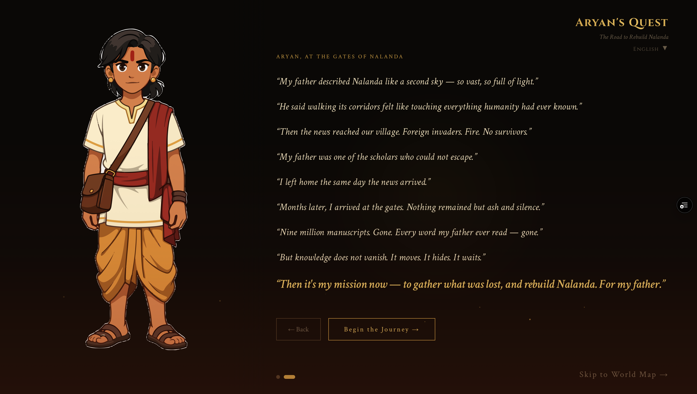

# Aryan's Quest: The Road to Rebuild Nalanda

> A multilingual historical puzzle RPG — built for [Lingo.dev Hackathon #3](https://www.wemakedevs.org/hackathons/lingohack25)

**Live Demo:** [questworldlingo.vercel.app](https://questworldlingo.vercel.app)



---

## About the Project

Aryan's Quest was built for **Lingo.dev Hackathon #3** (March 2026). The idea was simple: make learning history fun. Puzzle games are universally engaging, and combining them with real historical context — scholars who actually existed, manuscripts that are real, kingdoms at the height of their power in 1203 AD — makes the experience both entertaining and educational.

The multilingual layer was central from the start. A game about knowledge crossing borders should itself cross language barriers. Lingo.dev made that possible: the compiler handles the static UI at build time, and the Runtime SDK makes live AI conversations work in any language the player chooses.

---

## How Lingo.dev Is Used

This project integrates Lingo.dev in two distinct ways:

### 1. Compiler (Build-Time Translation)
All static UI text — kingdom names, scholar names, game instructions, button labels, mode toggles, character tabs — is automatically translated at build time into 8 target languages using the `@lingo.dev/compiler`. The compiler scans JSX text nodes and replaces them with locale-aware strings baked into the bundle.

```ts
// next.config.ts
export default async function (): Promise<NextConfig> {
  return await withLingo(nextConfig, {
    sourceLocale: "en",
    targetLocales: ["de", "fr", "es", "ja", "hi", "zh-TW", "ko", "ru"],
    models: "lingo.dev",
    buildMode: "translate",
    localePersistence: { type: "cookie" },
  });
}
```

### 2. Runtime SDK (Real-Time Translation)
Each kingdom has a live AI scholar powered by Google Gemini. When a player sends a message, the scholar's response is translated in real time using `LingoDotDevEngine.localizeText()` before it reaches the player.

This means:
- Write to the monk in any language — they respond naturally in that language
- The response is then translated into your selected app locale on the fly
- No pre-translation, no language selection required — it just works

```ts
// app/api/chat/[kingdom]/route.ts
const engine = new LingoDotDevEngine({ apiKey: process.env.LINGODOTDEV_API_KEY });
const translated = await engine.localizeText(geminiReply, { sourceLocale: "en", targetLocale: locale });
```

The scholars are not just difficulty-selectors. Each one is a fully realised AI character with deep historical context built into their system prompt — players can freely converse with them in any language, ask about their empire, their culture, the manuscripts they guard, or the history of their era. The Lingo.dev Runtime SDK ensures that these live, open-ended conversations are always delivered in the player's chosen language, regardless of what language the player typed in.

---

## Features

- **5 unique kingdoms**, each with a historically grounded scholar, artifact, and puzzle minigame
- **AI-powered scholar chat** — converse with each monk in any language; they assess your tone and attitude to set your game difficulty, then stay available to answer anything about their empire's history and culture
- **Real-time multilingual translation** via Lingo.dev Runtime SDK — scholar responses always arrive in your selected app locale, regardless of what language you wrote in
- **5 distinct puzzle types**: Tile Memory, Kings Placement (N-Queens), Arithmetic Sprint, Sudoku, and Island Bridges (Hashiwokakero)
- **9 supported languages**: English, German, French, Spanish, Japanese, Hindi, Chinese (Traditional), Korean, Russian
- **Knowledge Chest** — collect all 5 manuscripts and read their full historical excerpts
- **Games Only mode** — skip the story and jump directly into any puzzle at your chosen difficulty
- **About Game modal** — game background, hackathon context, and full character profiles for all 5 scholars + Aryan
- **No account required** — progress stored in localStorage

---

## Tech Stack

### Frontend
| Technology | Version | Purpose |
|---|---|---|
| Next.js | 16.1.6 | App framework (App Router) |
| React | 19.2.3 | UI library |
| TypeScript | 5 | Type safety |
| Tailwind CSS | v4 | Styling |
| Cinzel + Crimson Text | — | Game typography (Google Fonts) |

### AI & Language
| Technology | Purpose |
|---|---|
| **Lingo.dev Compiler** (`@lingo.dev/compiler`) | Build-time translation of all UI text into 8 languages |
| **Lingo.dev Runtime SDK** (`@lingo.dev/_sdk`) | Real-time translation of live AI scholar responses |
| **Google Gemini 2.5 Flash** (`@google/generative-ai`) | Powers scholar dialogue — unique system prompt per scholar, tone-based difficulty assessment, open-ended historical Q&A |

### Infrastructure
| Technology | Purpose |
|---|---|
| Next.js API Routes | Server-side proxy for Gemini API calls (keeps API key hidden from browser) |
| localStorage | Client-side game state (player name, collected artifacts, wisdom tokens) |
| Cookie (Lingo.dev) | Locale persistence across sessions |

---

## The Story

It is 1203 AD. The great Nalanda University — one of the world's oldest centres of learning — has been destroyed by invaders. Thousands of manuscripts, centuries of accumulated knowledge, are scattered across Asia.

You are **Aryan**, a young Indian scholar. Your mission: journey across five kingdoms — Srivijaya, Heian Japan, Goryeo Korea, Song Dynasty China, and the Tibetan Empire — to recover Nalanda's lost manuscripts and bring them home.

Each kingdom is guarded by a scholar-monk. They will not simply hand over what they protect. You must earn it — through dialogue, wit, and puzzle-solving.

---

## The Five Kingdoms

| Kingdom | Scholar | Artifact | Puzzle |
|---|---|---|---|
| **Srivijaya Empire** (Sumatra) | Dharmakirti | Nalanda-Srivijaya Correspondence | Tile Memory Match |
| **Heian Japan** (Kyoto) | Master Kukai | The Lotus Sutra Commentary | Kings Placement |
| **Goryeo Dynasty** (Korea) | Monk Uicheon | Tripitaka Koreana Excerpt | Arithmetic Sprint |
| **Song Dynasty** (China) | Shen Kuo | Dream Pool Essays | Sudoku |
| **Tibetan Empire** (Lhasa) | Sakya Pandita | Nalanda's Original Manuscripts | Island Bridges |

### Difficulty System
Each scholar assesses the **tone and attitude** of your message:
- **Humble, genuine, positive** → Easy trial (Level 1)
- **Neutral** → Medium trial (Level 2)
- **Rude, dismissive, arrogant** → Hard trial (Level 3)

The monk rewards humility and punishes arrogance. This is intentional.

---

## Game Flow

```
Opening Scene → Player Setup → World Map
                                    ↓
                          Kingdom: Scholar Chat
                          (3 preset choices + free AI chat)
                                    ↓
                            Puzzle Minigame
                          (difficulty set by scholar)
                                    ↓
                        Artifact Collected → Next Kingdom
                                    ↓
                       Knowledge Chest (all 5 manuscripts)
```

---

## Getting Started

### Prerequisites
- Node.js 18+
- A [Lingo.dev](https://lingo.dev) API key
- A [Google AI Studio](https://aistudio.google.com) API key (free tier available)

### Installation

```bash
git clone https://github.com/Aniket-d-d/questworldlingo.git
cd questworldlingo
npm install
```

### Environment Variables

Create a `.env.local` file in the root:

```env
LINGODOTDEV_API_KEY=your_lingo_api_key
GEMINI_API_KEY=your_google_gemini_api_key
```

### Run Locally

This project uses the Lingo.dev Compiler for build-time UI translations. To have all 9 languages available, run the build step first — this triggers the compiler to translate all static text and output the locale files:

```bash
npm run build
npm start
```

Alternatively, for development without translations (English only):

```bash
npm run dev
```

Open [http://localhost:3000](http://localhost:3000) in your browser.

### Vercel Deployment

The compiled translation JSON files are committed to `public/translations/` so Vercel can serve them as static assets without re-running the translation step on every deployment. Language switching triggers a page reload to ensure the correct locale is loaded from the start — this is intentional and works correctly in both local and production environments.

---

## Project Structure

```
questworldlingo/
├── app/
│   ├── page.tsx                  # Opening scene
│   ├── game/
│   │   ├── page.tsx              # World map
│   │   ├── chest/page.tsx        # Knowledge chest
│   │   └── [kingdom]/
│   │       └── page.tsx          # Scholar chat + minigame
│   └── api/chat/[kingdom]/
│       └── route.ts              # Gemini + Lingo.dev SDK API route
├── components/
│   ├── game/                     # Core game components
│   │   ├── OpeningScene.tsx
│   │   ├── WorldMap.tsx
│   │   ├── PlayerSetup.tsx
│   │   └── KingdomText.tsx       # Lingo.dev-compatible kingdom text
│   ├── minigames/                # 5 puzzle implementations
│   │   ├── TileGlow.tsx          # Memory match
│   │   ├── JapanKingsGame.tsx    # N-Queens variant
│   │   ├── KoreaMathGame.tsx     # Timed arithmetic
│   │   ├── ChinaSudokuGame.tsx   # Sudoku variants
│   │   └── TibetBridgesGame.tsx  # Hashiwokakero bridges
│   └── ui/
│       ├── GameHeader.tsx
│       ├── AboutGameModal.tsx
│       └── PageShell.tsx
├── constants/
│   ├── scholars.tsx              # Scholar configs + AI system prompts
│   ├── story.tsx                 # Kingdom data + travel lore
│   ├── miniGames.tsx             # Word pairs + puzzle data
│   └── languages.ts              # Supported locale list
├── public/
│   ├── translations/             # Compiled locale JSON files (served as static assets)
│   └── characters/               # Scholar + Aryan SVG avatars
└── next.config.ts                # Lingo.dev compiler config
```

---

## Supported Languages

| Language | Code |
|---|---|
| English | `en` |
| German | `de` |
| French | `fr` |
| Spanish | `es` |
| Japanese | `ja` |
| Hindi | `hi` |
| Chinese (Traditional) | `zh-TW` |
| Korean | `ko` |
| Russian | `ru` |

> The game UI, all labels, scholar names, and game mechanics text are fully translated into all 9 languages. The manuscript excerpts in the Knowledge Chest and the About Game page are kept in English — a deliberate technical choice, as translating dense historical prose accurately across 8 languages was outside the scope of this project.

---

## Hackathon Submission

- **Event:** [Lingo.dev Hackathon #3 — WeMakeDevs](https://www.wemakedevs.org/hackathons/lingohack25)
- **Submitted by:** Aniket
- **Lingo.dev features used:** Compiler (build-time UI translation) + Runtime SDK (real-time AI response translation)
